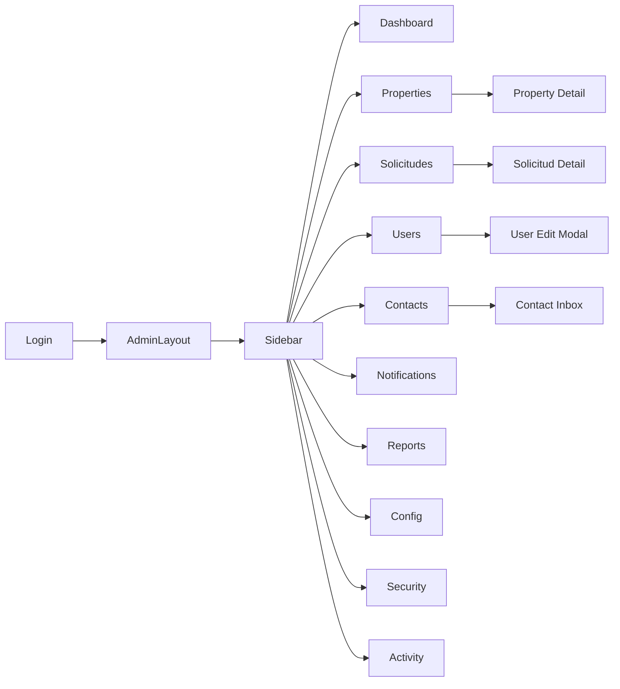

# Design Document: Admin Dashboard Redesign — SONOGROUP S.A.S.

## Overview

Transformación completa del panel administrativo de SONOGROUP de un CRUD básico con tabs horizontales a un sistema administrativo inmobiliario profesional tipo SaaS premium. La arquitectura reutiliza el stack existente (React + Vite, Express + Supabase, JWT) y lo extiende con nuevos módulos de frontend y backend organizados por dominio.

El diseño sigue el patrón **Feature-Sliced Design** en el frontend y **Route → Controller → Service** en el backend, garantizando escalabilidad y mantenibilidad.

---

## Architecture

```mermaid
graph TB
    subgraph Frontend ["Frontend (React + Vite)"]
        APP[App.jsx]
        ADMIN_LAYOUT[AdminLayout]
        SIDEBAR[Sidebar]
        NAVBAR[AdminNavbar]
        
        subgraph Pages ["Admin Pages"]
            DASH[Dashboard]
            PROPS[Properties]
            SOLIC[Solicitudes]
            USERS[Users]
            CRM[Contacts CRM]
            NOTIF[Notifications]
            REPORTS[Reports]
            CONFIG[Configuration]
            SEC[Security]
            ACT[Activity]
        end
        
        subgraph Shared ["Shared Components"]
            KPIC[KPICard]
            DTABLE[DataTable]
            FILTERS[FilterBar]
            CHARTS[ChartComponents]
            SKELETONS[Skeletons]
            BADGES[StatusBadge]
            MODALS[Modals]
        end
    end

    subgraph Backend ["Backend (Express + Supabase)"]
        subgraph AdminRoutes ["Admin Routes"]
            AR_STATS[/api/admin/stats]
            AR_INM[/api/admin/inmuebles]
            AR_USR[/api/admin/usuarios]
            AR_CONT[/api/admin/contactos]
            AR_ACT[/api/admin/actividad]
            AR_REP[/api/admin/reportes]
            AR_SES[/api/admin/sesiones]
        end
        
        subgraph Existing ["Existing Routes (reused)"]
            ER_PEND[/api/propiedades-pendientes]
            ER_NOTIF[/api/notificaciones]
            ER_CONF[/api/configuracion]
            ER_USR[/api/usuarios]
        end
        
        MW[Auth Middleware]
        DB[(Supabase PostgreSQL)]
    end

    APP --> ADMIN_LAYOUT
    ADMIN_LAYOUT --> SIDEBAR
    ADMIN_LAYOUT --> NAVBAR
    ADMIN_LAYOUT --> Pages
    Pages --> Shared
    Pages --> AdminRoutes
    Pages --> Existing
    AdminRoutes --> MW --> DB
    Existing --> MW
```

---

## Components and Interfaces

### Frontend Structure

```
frontend/src/
├── pages/
│   └── admin/                          ← NEW: admin pages directory
│       ├── AdminLayout.jsx             ← Layout wrapper with sidebar + navbar
│       ├── AdminDashboard.jsx          ← Refactored dashboard (replaces old)
│       ├── AdminProperties.jsx         ← Advanced properties management
│       ├── AdminPropertyDetail.jsx     ← Property detail admin view
│       ├── AdminSolicitudes.jsx        ← Moderation module
│       ├── AdminUsers.jsx              ← User management
│       ├── AdminContacts.jsx           ← CRM module
│       ├── AdminNotifications.jsx      ← Notifications page
│       ├── AdminReports.jsx            ← Analytics & reports
│       ├── AdminConfig.jsx             ← System configuration
│       ├── AdminSecurity.jsx           ← Security & sessions
│       └── AdminActivity.jsx           ← Activity feed
├── components/
│   └── admin/                          ← NEW: admin-specific components
│       ├── layout/
│       │   ├── AdminSidebar.jsx        ← Collapsible sidebar
│       │   └── AdminNavbar.jsx         ← Top navbar with search + notifications
│       ├── dashboard/
│       │   ├── KPICard.jsx             ← Metric card with sparkline
│       │   ├── KPICardSkeleton.jsx     ← Loading skeleton
│       │   ├── ActivityFeed.jsx        ← Recent activity list
│       │   └── RecentProperties.jsx    ← Latest properties widget
│       ├── properties/
│       │   ├── PropertyRow.jsx         ← Table row with actions
│       │   ├── PropertyFiltersBar.jsx  ← Advanced filter bar
│       │   └── RejectModal.jsx         ← Rejection reason modal
│       ├── users/
│       │   ├── UserRow.jsx             ← Table row with actions
│       │   └── UserEditModal.jsx       ← Edit user modal
│       ├── contacts/
│       │   ├── ContactRow.jsx          ← CRM table row
│       │   └── ContactDetail.jsx       ← Conversation inbox view
│       ├── shared/
│       │   ├── DataTable.jsx           ← Reusable table with sort/pagination
│       │   ├── FilterBar.jsx           ← Generic filter bar
│       │   ├── StatusBadge.jsx         ← Colored status badge
│       │   ├── ConfirmDialog.jsx       ← Confirmation modal
│       │   ├── EmptyState.jsx          ← Empty state with illustration
│       │   ├── PageHeader.jsx          ← Page title + breadcrumb
│       │   └── SkeletonTable.jsx       ← Table skeleton loader
│       └── charts/
│           ├── PublicationsBarChart.jsx
│           ├── UsersLineChart.jsx
│           ├── PropertyTypeDonut.jsx
│           └── MonthlyMetricsTable.jsx
└── hooks/
    └── admin/                          ← NEW: admin-specific hooks
        ├── useAdminStats.js
        ├── useAdminProperties.js
        ├── useAdminUsers.js
        ├── useAdminContacts.js
        └── useAdminNotifications.js
```

### Backend Structure

```
backend/src/
├── routes/
│   └── admin/                          ← NEW: consolidated admin routes
│       ├── admin-stats.routes.js
│       ├── admin-inmuebles.routes.js
│       ├── admin-usuarios.routes.js
│       ├── admin-contactos.routes.js
│       ├── admin-actividad.routes.js
│       ├── admin-reportes.routes.js
│       └── admin-sesiones.routes.js
├── controllers/
│   └── admin/                          ← NEW: admin controllers
│       ├── stats.controller.js
│       ├── inmuebles.controller.js
│       ├── usuarios.controller.js
│       ├── contactos.controller.js
│       ├── actividad.controller.js
│       ├── reportes.controller.js
│       └── sesiones.controller.js
└── services/
    └── admin/                          ← NEW: admin services
        ├── stats.service.js
        ├── inmuebles.service.js
        ├── usuarios.service.js
        ├── contactos.service.js
        ├── actividad.service.js
        └── reportes.service.js
```

### Key Component Interfaces

```javascript
// KPICard props
{
  title: string,
  value: number | string,
  change: number,          // percentage change vs previous period
  trend: 'up' | 'down' | 'neutral',
  icon: LucideIcon,
  color: 'blue' | 'green' | 'yellow' | 'red' | 'purple',
  sparklineData: number[]  // last 7 data points
}

// DataTable props
{
  columns: ColumnDef[],
  data: any[],
  loading: boolean,
  pagination: { page, limit, total },
  onPageChange: (page) => void,
  onSort: (column, direction) => void,
  emptyMessage: string
}

// StatusBadge props
{
  status: 'pendiente' | 'aprobado' | 'rechazado' | 'activo' | 'suspendido' | 'cerrado' | 'respondido',
  size?: 'sm' | 'md'
}
```

---

## Data Models

### API Response Contract

All admin endpoints return:
```javascript
// Success
{
  success: true,
  data: any,
  message?: string,
  pagination?: {
    page: number,
    limit: number,
    total: number,
    totalPages: number
  }
}

// Error
{
  success: false,
  error: string,
  details?: any
}
```

### Dashboard Stats Response (`GET /api/admin/stats/dashboard`)
```javascript
{
  kpis: {
    totalPropiedades: number,
    propiedadesAprobadas: number,
    propiedadesPendientes: number,
    propiedadesRechazadas: number,
    usuariosActivos: number,
    nuevosUsuariosSemana: number,
    contactosSinResponder: number,
    favoritosTotales: number,
    propiedadesDestacadas: number,
    publicacionesActivas: number,
    publicacionesVencidas: number
  },
  changes: {  // percentage change vs previous period
    totalPropiedades: number,
    usuariosActivos: number,
    contactosSinResponder: number
  }
}
```

### Admin Inmuebles Query Params
```
GET /api/admin/inmuebles?page=1&limit=20&search=&tipo=&operacion=&estado_aprobacion=&precio_min=&precio_max=&sort_by=created_at&sort_order=desc
```

### Admin Usuarios Query Params
```
GET /api/admin/usuarios?page=1&limit=25&search=&rol=&estado=
```

### Admin Contactos Query Params
```
GET /api/admin/contactos?page=1&limit=20&search=&estado=&prioridad=
```

### New Database Tables

```sql
-- actividad_admin: audit trail of all admin actions
CREATE TABLE actividad_admin (
    id_actividad    SERIAL PRIMARY KEY,
    admin_id        INTEGER REFERENCES usuarios(id_usuario) ON DELETE SET NULL,
    accion          VARCHAR(100) NOT NULL,
    recurso_tipo    VARCHAR(50),
    recurso_id      INTEGER,
    detalles        JSONB,
    ip_address      VARCHAR(45),
    created_at      TIMESTAMP DEFAULT CURRENT_TIMESTAMP
);

-- notas_contacto: internal CRM notes
CREATE TABLE notas_contacto (
    id_nota         SERIAL PRIMARY KEY,
    contacto_id     INTEGER NOT NULL REFERENCES contactos(id_contacto) ON DELETE CASCADE,
    admin_id        INTEGER REFERENCES usuarios(id_usuario) ON DELETE SET NULL,
    nota            TEXT NOT NULL,
    created_at      TIMESTAMP DEFAULT CURRENT_TIMESTAMP
);
```

### Existing Table Extensions

```sql
-- inmuebles extensions
ALTER TABLE inmuebles ADD COLUMN IF NOT EXISTS destacado BOOLEAN DEFAULT FALSE;
ALTER TABLE inmuebles ADD COLUMN IF NOT EXISTS vistas INTEGER DEFAULT 0;

-- usuarios extensions
CREATE TYPE estado_usuario AS ENUM ('activo', 'suspendido');
ALTER TABLE usuarios ADD COLUMN IF NOT EXISTS estado_usuario estado_usuario DEFAULT 'activo';
ALTER TABLE usuarios ADD COLUMN IF NOT EXISTS ultimo_acceso TIMESTAMPTZ;

-- contactos extensions
CREATE TYPE prioridad_contacto AS ENUM ('baja', 'media', 'alta');
ALTER TABLE contactos ADD COLUMN IF NOT EXISTS agente_asignado_id INTEGER REFERENCES usuarios(id_usuario) ON DELETE SET NULL;
ALTER TABLE contactos ADD COLUMN IF NOT EXISTS prioridad prioridad_contacto DEFAULT 'media';
ALTER TABLE contactos ADD COLUMN IF NOT EXISTS archivado BOOLEAN DEFAULT FALSE;
```

---

## Design Decisions

### 1. AdminLayout as Route Wrapper
The new admin section uses a dedicated `AdminLayout` component that wraps all admin pages. This layout renders the sidebar and top navbar, and the page content fills the remaining space. This replaces the old single-file `AdminDashboard.jsx` monolith.

**Rationale**: Separation of concerns. Each admin page is independent, testable, and lazy-loadable.

### 2. Tailwind CSS + CSS Variables for Theming
All admin components use Tailwind utility classes. A CSS variable layer (`--admin-sidebar-bg`, `--admin-card-bg`, etc.) allows theme switching without class changes.

**Rationale**: Tailwind provides rapid development; CSS variables enable future dark/light mode toggle.

### 3. Server-Side Filtering and Pagination
All tables (properties, users, contacts) use server-side pagination and filtering. The frontend sends query params; the backend applies them via Supabase `.range()`, `.ilike()`, and `.eq()` calls.

**Rationale**: The dataset can grow large. Client-side filtering would not scale.

### 4. URL-Persisted Filters
Active filters are stored in URL query parameters using React Router's `useSearchParams`. This allows sharing filtered views and surviving page refreshes.

**Rationale**: Better UX for admins who work with specific filtered views regularly.

### 5. Consolidated Admin Routes
New admin endpoints are grouped under `/api/admin/*` with a shared middleware chain (`verificarToken` + `verificarRol(['admin'])`). Existing routes are reused where possible.

**Rationale**: Clear separation between public/user API and admin API. Easier to audit and secure.

### 6. Recharts for Charts
Recharts is chosen as the charting library because it is React-native, composable, and has good TypeScript support.

**Rationale**: Lightweight, well-maintained, integrates naturally with React state.

### 7. Framer Motion for Animations
Page transitions use `AnimatePresence` + `motion.div`. Micro-interactions (hover, tap) use `whileHover` and `whileTap` props.

**Rationale**: Declarative animation API that integrates with React without imperative DOM manipulation.

---

## Visual Design System

### Color Palette
```
Sidebar background:    #0f172a  (slate-900)
Sidebar active item:   #1e293b  (slate-800) + left border #6366f1 (indigo-500)
Content background:    #f8fafc  (slate-50)
Card background:       #ffffff
Card border:           #e2e8f0  (slate-200)
Primary accent:        #6366f1  (indigo-500)
Success:               #10b981  (emerald-500)
Warning:               #f59e0b  (amber-500)
Danger:                #ef4444  (red-500)
Text primary:          #0f172a  (slate-900)
Text secondary:        #64748b  (slate-500)
```

### Typography
```
Font family:  Inter (Google Fonts)
Headings:     font-semibold, tracking-tight
Body:         font-normal, leading-relaxed
Labels:       text-xs, font-medium, uppercase, tracking-wide
```

### Spacing & Layout
```
Sidebar width expanded:   240px
Sidebar width collapsed:  64px
Top navbar height:        64px
Content padding:          24px (p-6)
Card padding:             24px (p-6)
Card border-radius:       12px (rounded-xl)
Card shadow:              0 1px 3px rgba(0,0,0,0.1), 0 1px 2px rgba(0,0,0,0.06)
```

### Status Badge Colors
```
pendiente:   bg-amber-100  text-amber-700  border-amber-200
aprobado:    bg-emerald-100 text-emerald-700 border-emerald-200
rechazado:   bg-red-100    text-red-700    border-red-200
activo:      bg-blue-100   text-blue-700   border-blue-200
suspendido:  bg-slate-100  text-slate-600  border-slate-200
respondido:  bg-purple-100 text-purple-700 border-purple-200
cerrado:     bg-gray-100   text-gray-600   border-gray-200
```

---

## Page Layouts

### Dashboard Layout
```
┌─────────────────────────────────────────────────────────┐
│  KPI Row: [Total Props] [Aprobadas] [Pendientes] [...]  │
├──────────────────────────┬──────────────────────────────┤
│  Bar Chart               │  Donut Chart                 │
│  (Publications/month)    │  (Property types)            │
├──────────────────────────┼──────────────────────────────┤
│  Line Chart              │  Activity Feed               │
│  (User growth)           │  (Recent actions)            │
├──────────────────────────┴──────────────────────────────┤
│  Recent Properties Table (last 5)                       │
│  Pending Approvals Table (last 5)                       │
└─────────────────────────────────────────────────────────┘
```

### Properties Table Layout
```
┌─────────────────────────────────────────────────────────┐
│  [Search] [Tipo ▼] [Operación ▼] [Estado ▼] [Precio ▼] │
├─────────────────────────────────────────────────────────┤
│  Img │ Nombre │ Ubicación │ Propietario │ Tipo │ Precio │
│      │        │           │             │      │ Estado │
│      │        │           │             │      │ Acciones│
├─────────────────────────────────────────────────────────┤
│  [← Prev]  Page 1 of N  [Next →]   Showing 20 of total │
└─────────────────────────────────────────────────────────┘
```

---

## Mermaid: Admin Navigation Flow



---

## Error Handling

### Frontend
- All API calls wrapped in try/catch with `parseApiError()` from existing `api.js`
- Network errors show toast: "Error de conexión. Verifica tu internet."
- 401 errors: existing interceptor redirects to `/login`
- 403 errors: show toast "No tienes permisos para esta acción"
- 404 errors: show empty state component
- 500 errors: show error state with retry button

### Backend
- All admin controllers use try/catch and return consistent error format
- Validation errors return 400 with field-level details
- Auth errors handled by existing middleware (401/403)
- Database errors logged server-side, generic message to client
- All errors logged to `actividad_admin` table with `accion: 'error'`

---

## Correctness Properties

*A property is a characteristic or behavior that should hold true across all valid executions of a system — essentially, a formal statement about what the system should do. Properties serve as the bridge between human-readable specifications and machine-verifiable correctness guarantees.*

### Property-Based Testing Overview

Property-based testing (PBT) validates software correctness by testing universal properties across many generated inputs. Each property is a formal specification that should hold for all valid inputs. The PBT library used is **fast-check** (JavaScript/TypeScript).

---

Property 1: Sidebar toggle is idempotent in pairs
*For any* initial sidebar state (expanded or collapsed), toggling twice should return to the original state.
**Validates: Requirements 1.2**

---

Property 2: KPI card renders all required fields
*For any* valid KPI data object (with title, value, change, trend, sparklineData), the rendered KPICard component should contain all five required display elements.
**Validates: Requirements 2.4**

---

Property 3: Pagination invariant
*For any* admin list endpoint (properties, users, contacts) called with a valid page and limit, the response data array length should be at most `limit`, and the pagination metadata should correctly reflect total count and total pages.
**Validates: Requirements 3.5, 5.10, 13.3**

---

Property 4: Search filter consistency
*For any* non-empty search query applied to the properties or users list, every item in the returned results should contain the search query string in at least one of its searchable fields (case-insensitive).
**Validates: Requirements 3.2, 13.3**

---

Property 5: URL filter round-trip
*For any* set of active filters applied in the properties table, serializing them to URL query parameters and then parsing those parameters back should produce an equivalent filter state.
**Validates: Requirements 3.13**

---

Property 6: Rejection reason minimum length
*For any* rejection reason string with fewer than 10 characters (including empty string and whitespace-only strings), the rejection action should be blocked and the solicitud status should remain unchanged.
**Validates: Requirements 4.5**

---

Property 7: Urgente badge timing
*For any* solicitud with a `created_at` timestamp more than 48 hours before the current time, the urgente priority badge should be displayed on that row.
**Validates: Requirements 4.8**

---

Property 8: Contact badge count accuracy
*For any* state of the contacts collection, the unread badge count displayed on the Contactos sidebar item should equal the exact count of contacts with `estado_contacto = 'pendiente'` and `archivado = false`.
**Validates: Requirements 6.8**

---

Property 9: Notification badge count accuracy
*For any* state of the notifications collection, the unread badge count on the bell icon should equal the exact count of notifications with `leido = false` for the current admin user.
**Validates: Requirements 7.1**

---

Property 10: Admin endpoint authorization
*For any* request to any `/api/admin/*` endpoint without a valid JWT token, or with a token belonging to a non-admin user, the endpoint should return HTTP 401 or 403 respectively.
**Validates: Requirements 13.11**

---

Property 11: Admin API response structure consistency
*For any* successful response from any `/api/admin/*` endpoint, the response body should contain a `success: true` field and a `data` field. For any error response, it should contain `success: false` and an `error` string field.
**Validates: Requirements 13.12**

---

Property 12: Analytics date range filter
*For any* date range filter (start_date, end_date) applied to analytics endpoints, all data points in the response should have timestamps that fall within the specified range (inclusive).
**Validates: Requirements 8.3**

---

## Testing Strategy

### Dual Testing Approach

Both unit tests and property-based tests are required and complementary:

- **Unit tests**: Verify specific examples, edge cases, and integration points
- **Property tests**: Verify universal properties hold across all inputs using fast-check

### Unit Tests (Vitest + React Testing Library)

Focus areas:
- `StatusBadge` renders correct color class for each status value
- `KPICard` renders correctly with positive and negative change values
- `RejectModal` blocks submission when reason is empty or < 10 chars
- `DataTable` renders correct number of rows for given data
- Admin API endpoints return correct structure for known inputs
- Auth middleware blocks non-admin requests (specific examples)
- `parseApiError` handles all known error codes correctly

### Property-Based Tests (fast-check)

Each property from the Correctness Properties section maps to exactly one property-based test:

| Property | Test File | fast-check Arbitraries |
|----------|-----------|----------------------|
| P1: Sidebar toggle idempotent | `AdminSidebar.test.jsx` | `fc.boolean()` |
| P2: KPI card renders all fields | `KPICard.test.jsx` | `fc.record({title, value, change, trend, sparklineData})` |
| P3: Pagination invariant | `admin-stats.test.js` | `fc.integer({min:1,max:100})` for page/limit |
| P4: Search filter consistency | `admin-inmuebles.test.js` | `fc.string()` for search query |
| P5: URL filter round-trip | `PropertyFiltersBar.test.jsx` | `fc.record({tipo, operacion, estado})` |
| P6: Rejection reason length | `RejectModal.test.jsx` | `fc.string({maxLength:9})` |
| P7: Urgente badge timing | `AdminSolicitudes.test.jsx` | `fc.date()` for created_at |
| P8: Contact badge count | `AdminContacts.test.jsx` | `fc.array(fc.record({estado, archivado}))` |
| P9: Notification badge count | `AdminNavbar.test.jsx` | `fc.array(fc.record({leido}))` |
| P10: Admin endpoint auth | `admin-auth.test.js` | `fc.string()` for invalid tokens |
| P11: API response structure | `admin-api.test.js` | All admin endpoints |
| P12: Analytics date range | `admin-reportes.test.js` | `fc.date()` pairs |

### Configuration
- Minimum 100 iterations per property test
- Tag format: `// Feature: admin-dashboard-redesign, Property N: {property_text}`
- Test runner: Vitest (frontend), Jest or Vitest (backend)
- fast-check version: latest stable

### Test File Locations
- Frontend tests: co-located with components (`*.test.jsx`)
- Backend tests: `backend/src/__tests__/admin/`
